### 1. Робота з колірним колесом (Color Wheel)
## Analagous
# Скріншот
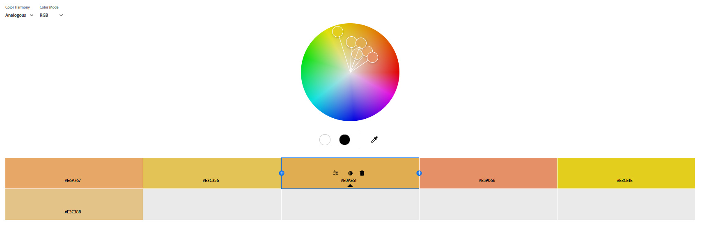
# Базовий колір - EOAE51
# Короткий коментар
Побудована на близьких за спектром кольорах — м’яка, природна й спокійна гамма. Основний колір підтримується допоміжним і акцентним.
## Monochromatic
# Скріншот
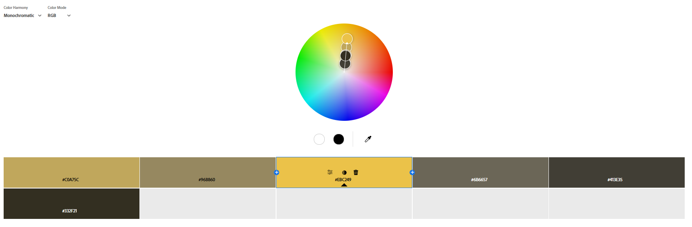
# Базовий колір - EBC249
# Короткий коментар
Відтінки одного кольору з різними рівнями яскравості та насиченості створюють гармонійне й спокійне враження.
## Triad
# Скріншот
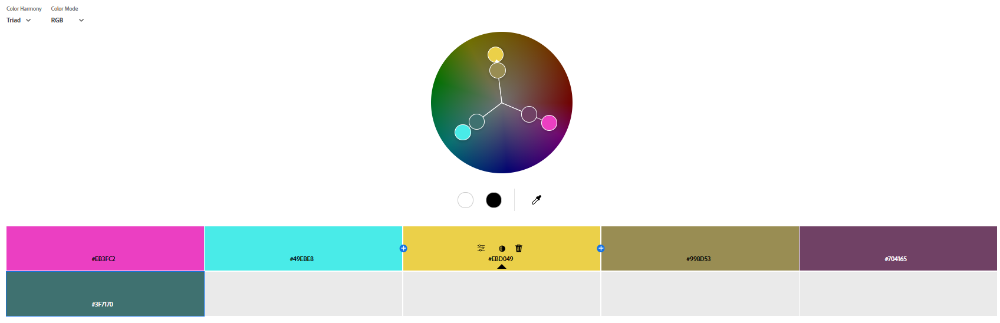
# Базовий колір - EBD049
# Короткий коментар
Три кольори, рівномірно розташовані на колірному колі, формують живу й збалансовану палітру, навіть у м’яких тонах; один головний, два — акцентні.
## Complementary
# Скріншот
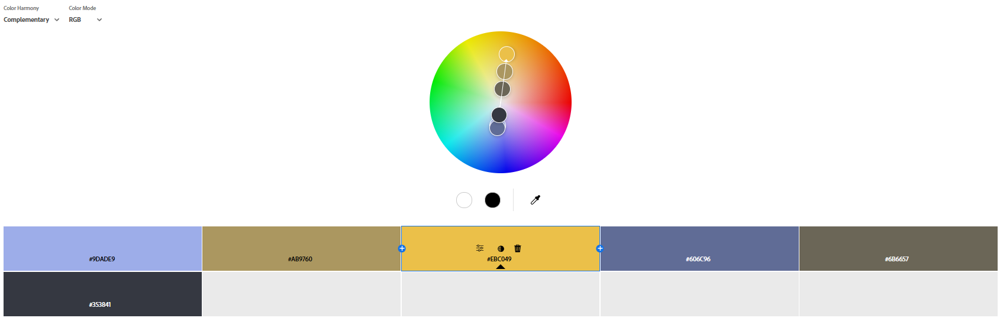
# Базовий колір - EBC049
# Короткий коментар.
Контрастна пара — це кольори, що знаходяться навпроти один одного на колі. Вони утворюють яскраве й динамічне поєднання, яке чудово підходить для виразних акцентів.
## Split Complementary
# Скріншот
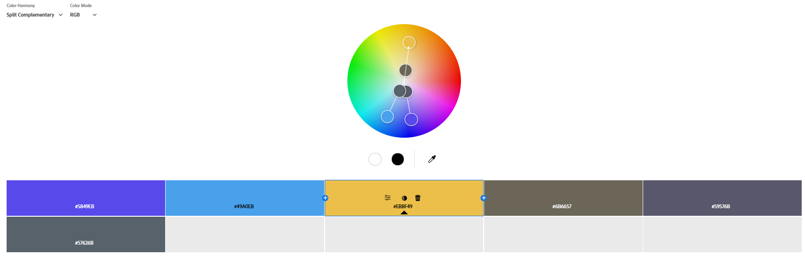
# Базовий колір - EBBF49
# Короткий коментар
М’якший варіант комплементарної схеми: основний колір поєднується з двома кольорами, що сусідять з його протилежним. Така палітра зберігає контраст, але виглядає делікатніше; це безпечний вибір для акцентів.
## Square
# Скріншот
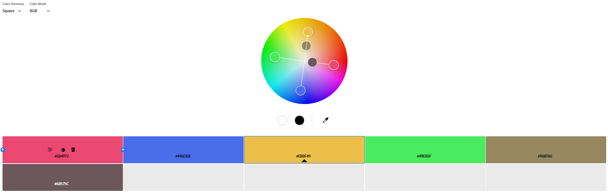
# Базовий колір - EBBF49
# Короткий коментар
Поєднання чотирьох кольорів, рівновіддалених на колі, створює насичену й динамічну палітру. Для збереження балансу варто виділити один колір як основний.
## Custom
# Скріншот
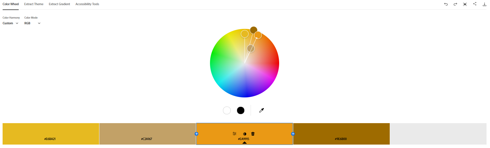
# Базовий колір - EA9915
# Короткий коментар
Палітра, сформована інтуїтивно, за особистим смаком дизайнера.
### 2. Створення палітри зображенням (Extract Theme)
## Colorful
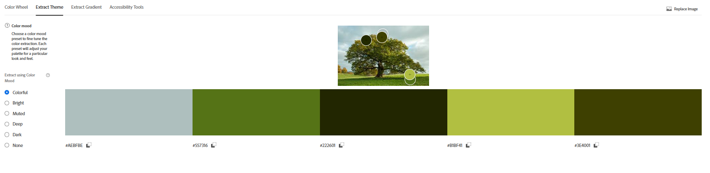
## Muted
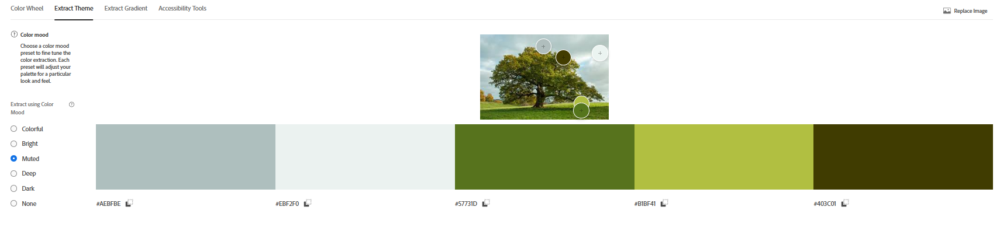
## Коментар
Muted краще підходить для інтерфейсу додатку так яка має краще поєднання кольорів.
### 3. Створення градієнту на основі зображення (Extract Gradient)
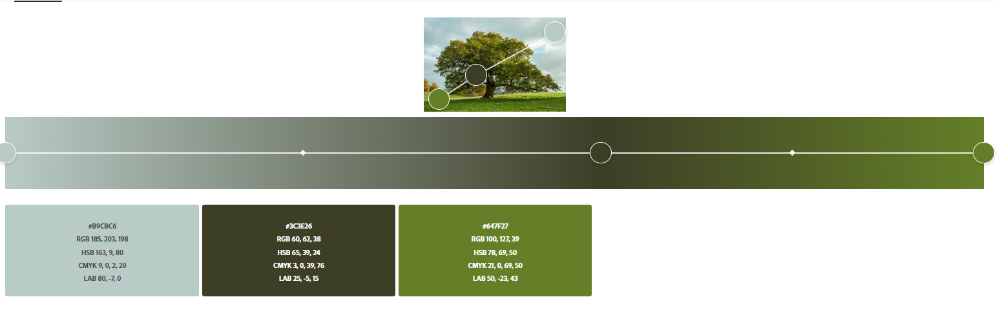
### 4. Аналіз контрасту (Accessibility Tools)
**Обрана пара кольорів із палітри Analagous**:  
- **Текст**: `#E0AE51`
- **Фон**: `#E6A767`
# Висновок
- ❌ **AA (4.5:1)**: Не проходить для звичайного тексту (менше 18pt)  
- ❌ **AAA (7:1)**: Не проходить для великого тексту (18pt+)  
### Корекція контрасту:
Інструмент запропонував змінити колір фону на темніший:  
- **Новий фон**: `#2C1D0E`  

**Підсумок після корекції**:  
- ✅ **AA (4.5:1)**: Проходить для звичайного тексту  
- ✅ **AAA (8.02:1)**: Підходить для будь-якого тексту  

### Коментар:
Початкова пара кольорів мала замалий контраст через схожу яскравість жовтого та помаранчевого. Після затемнення фону до `#2C1D0E` контраст покращився до достатньго рівня АА та ААА.

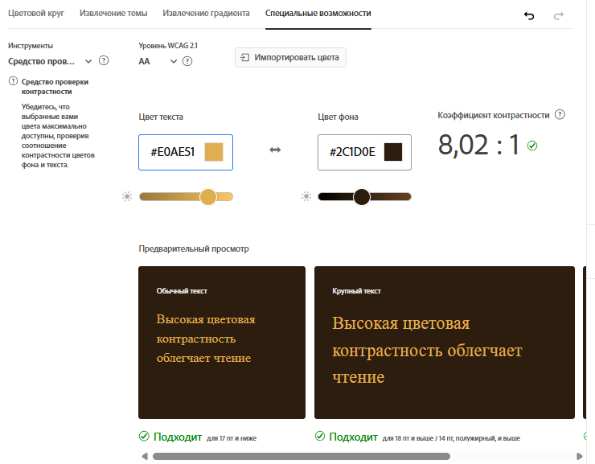

## Висновки

1. **Гармонії**:  
   - *Монохроматичні/аналогічні* — спокійні інтерфейси, *комплементарні* — акценти, *тріада/квадрат* — креативні рішення.  

2. **Контрастність**:  
   - Навіть гармонійні пари (наприклад, синій + оранжевий) часто потребують корекції (затемнення фону, світлий текст) для відповідності WCAG.  

3. **Рекомендації**:  
   - Для читабельності: монохроматика, перевірка контрасту.  
   - Для AAA: темний фон + яскравий текст (наприклад, `#E0AE51` + `#2C1D0E`).  
